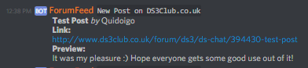

# vBulletin-Discord-Bot

Gets updates from a vBulletin RSS feed and posts them in a discord channel.

## Setup

Get a bot token and a channel ID by following the instructions found at: https://github.com/Chikachi/DiscordIntegration/wiki/How-to-get-a-token-and-channel-ID-for-Discord

Also enable the RSS feed for your vBulletin board, and get the URL. See: http://bfy.tw/GpLA

Alter the [config.json](config.json) file to include this bot token, channel id, and RSS feed URL.

eg.

```buildoutcfg
{
  "bot_token": "some.token.fromDiscord",
  "channel_id": "1234567890",
  "update_frequency": "60",
  "rss_feed_url": "https://my.forum-url.com/external.php?type=rss",
  "forum_name": "My Forum Name"
}
```

You can change `update_frequency` to change how often the forum is polled, this value is in seconds.

## Running the Script

This project is Python >3.4, and uses pipenv.

Python 3: http://bfy.tw/GojO

Pipenv: http://bfy.tw/GojW

Make sure you have both installed and then run:

```
pipenv install
pipenv shell
python vbulletin-discord-bot.py
```

Off you go!

## Example

The bot will make a discord post similar to the below when a new forum post is made:



## License

This project is licensed under the MIT License - see the [LICENSE](LICENSE) file for details.